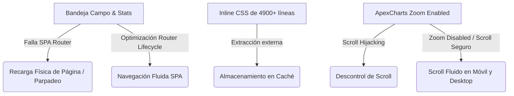

# UV Servicios - Centro de Optimizaciones y Mejoras del Sistema (Agosto 2026)

Este documento detalla las optimizaciones de arquitectura frontend, diseño responsivo, rendimiento y visualización de gráficos personalizados implementadas para resolver problemas de parpadeos, bloqueos de scroll y cuellos de botella de datos en la plataforma UV Servicios.

---

## 📋 Resumen de Mejoras Implementadas



---

## 🛠️ Detalle Técnico de los Cambios

### 1. Enrutamiento SPA Fluido y Ciclo de Vida del Router
* **Problema detectado:** Al navegar hacia el módulo administrativo de **Campo** o la **Gestión de Usuarios**, la SPA hacía una transición fallida porque sus scripts principales no estaban integrados con el ciclo de vida del router y cargaban el archivo JS de manera directa. Esto forzaba una recarga física (`window.location.reload`), provocando molestos flashes o parpadeos de pantalla.
* **Solución aplicada:**
  * Se configuraron [campo-admin.html](file:///c:/Users/johnl/OneDrive/Escritorio/uvservicios/campo-admin.html) y [gestion-usuarios.html](file:///c:/Users/johnl/OneDrive/Escritorio/uvservicios/gestion-usuarios.html) para vincular únicamente el script enrutador común [router.js](file:///c:/Users/johnl/OneDrive/Escritorio/uvservicios/js/services/router.js).
  * Se definieron y exportaron las funciones `initCampoAdmin` y `destroyCampoAdmin` en el controlador [campo-admin.js](file:///c:/Users/johnl/OneDrive/Escritorio/uvservicios/js/campo-admin.js) para inicializar y limpiar la bandeja dinámicamente.
* **Resultado:** Las transiciones de navegación entre páginas son instantáneas, fluidas y libres de cualquier parpadeo de pantalla.

### ⚡ Extracción de CSS Externo (Optimización de Carga y Caché)
* **Problema detectado:** `campo-admin.html` tenía un bloque inline `<style>` de aproximadamente **4000 líneas**, y `gestion-usuarios.html` tenía unas **950 líneas**. Esto inflaba el peso físico de los archivos HTML y evitaba que el navegador cacheara el diseño.
* **Solución aplicada:**
  * Se creó [campo-admin-page.css](file:///c:/Users/johnl/OneDrive/Escritorio/uvservicios/css/campo-admin-page.css) y [gestion-usuarios-page.css](file:///c:/Users/johnl/OneDrive/Escritorio/uvservicios/css/gestion-usuarios-page.css) respectivamente.
  * Se eliminaron los bloques inline de los HTMLs reemplazándolos con etiquetas `<link rel="stylesheet">` externas.
* **Resultado:** Reducción dramática del tamaño inicial del HTML (ej. `campo-admin.html` disminuyó de **151 KB a 33 KB**). Aceleración del tiempo de renderizado gracias al cacheado CSS nativo del navegador.

### 📱 Unificación del Breakpoint Móvil
* **Problema detectado:** Había una discrepancia entre el punto de quiebre CSS (`1180px`) y la detección JavaScript en `campo-admin.js` (`1024px`). En laptops pequeñas o tablets horizontales, JavaScript asumía un diseño desktop mientras que el CSS ya había convertido la bandeja en una sola columna, rompiendo la experiencia master-detail.
* **Solución aplicada:** Se cambió el breakpoint responsivo en [campo-admin.js](file:///c:/Users/johnl/OneDrive/Escritorio/uvservicios/js/campo-admin.js) a `1180` para coincidir perfectamente con la maquetación.
* **Resultado:** Layout master-detail uniforme y navegación táctil consistente en todos los dispositivos.

### ⏳ Integración del Cargador de Carga Premium
* **Problema detectado:** Al abrir Campo o Estadísticas, el DOM vacío se renderizaba instantáneamente antes de que las consultas de Supabase se resolvieran, lo que causaba saltos visuales bruscos (*Cumulative Layout Shift*).
* **Solución aplicada:** Se integró el markup `#premium-loader` en los HTML correspondientes y se configuraron las promesas en JS para agregar la clase `.hidden` al cargador premium una vez que todos los datos y gráficos están renderizados en pantalla.

### 📈 Motor de Gráficos Personalizados Inteligente
* **Puntos de Dispersión Automáticos:** Las variables pertenecientes a mediciones esporádicas de nivel/Echómetro (`nivel_dinamico`, `sumergencia`, `echometer_pip`) ahora se renderizan **automáticamente solo con puntos aislados** (ancho de línea `0` y tamaño de marcador `6`), previniendo que se tracen líneas artificiales que confundan a la ingeniería.
* **Líneas y Sombreados Automáticos:** Parámetros continuos de presión, eléctricos y VSD se grafican por defecto con líneas spline continuas y un degradado premium translúcido de fondo (`area` type).
* **Checkbox de Fondo:** Se agregó el control **"Sombreado de área"** en [stats.html](file:///c:/Users/johnl/OneDrive/Escritorio/uvservicios/stats.html) para permitir remover el degradado a gusto de la supervisión técnica.
* **Scroll Seguro sin Secuestros:** Se configuró `zoom: { enabled: false }` en ApexCharts para evitar que la gráfica intercepte el scroll vertical del mouse o el arrastre táctil del dedo. El usuario puede navegar verticalmente de forma 100% libre.

### 📸 Límite de Fotos de Soportes Incrementado (Operador Campo)
* **Problema detectado:** Los técnicos en campo necesitaban subir más respaldos visuales de un pozo, pero el sistema tenía un límite rígido de máximo 5 fotos por pozo por turno.
* **Solución aplicada:** Se aumentó el límite de carga de soportes de **5 a 20 imágenes** en los controladores [field-controller.js](file:///c:/Users/johnl/OneDrive/Escritorio/uvservicios/js/modules/field/field-controller.js) y [database-controller.js](file:///c:/Users/johnl/OneDrive/Escritorio/uvservicios/js/modules/database/database-controller.js).
* **Resultado:** Los técnicos ahora pueden adjuntar hasta 20 imágenes sin toparse con el límite restrictivo, facilitando el reporte de múltiples evidencias de ingeniería.

### 🔌 Nuevo Estatus: OFF / ATENCION AL CLIENTE
* **Problema detectado:** El equipo requería registrar pozos detenidos por atención/requerimiento del cliente y obligar al técnico a justificar dicha parada mediante el Diagnóstico y las Observaciones, omitiendo el ingreso de telemetría eléctrica (ya que el pozo está apagado).
* **Solución aplicada:**
  * Se agregó la opción `OFF / ATENCION AL CLIENTE` en [field.html](file:///c:/Users/johnl/OneDrive/Escritorio/uvservicios/field.html) y [dashboard-data.html](file:///c:/Users/johnl/OneDrive/Escritorio/uvservicios/dashboard-data.html).
  * Se actualizaron las validaciones en JS ([field-validation.js](file:///c:/Users/johnl/OneDrive/Escritorio/uvservicios/js/modules/field/field-validation.js), [field-controller.js](file:///c:/Users/johnl/OneDrive/Escritorio/uvservicios/js/modules/field/field-controller.js) y [field-formatters.js](file:///c:/Users/johnl/OneDrive/Escritorio/uvservicios/js/modules/field/field-formatters.js)) para clasificarlo como estado inactivo/OFF (saltando la verificación eléctrica pero forzando el llenado obligatorio de **Diagnóstico** y **Observaciones**).
  * Se integró en [estadisticas.js](file:///c:/Users/johnl/OneDrive/Escritorio/uvservicios/js/estadisticas.js) para clasificarlo correctamente como pozo "OFF" en las gráficas, sumarios y listados de incidencias.

### 🚀 Optimización del Modal de Adjuntos y Filtrado de Pozos Extras
* **Problema detectado:** 
  1. Al abrir el selector de "Pozos extras" en el modal de adjuntos, se listaban todos los pozos de la base de datos (mezclando Ceiba, Tomoporo, Mene Grande, etc.) en lugar de limitarse a los pozos del contrato en el que trabaja el técnico.
  2. Debido a las llamadas en red asíncronas para resolver previsualizaciones y pozos extras, el modal se cargaba en blanco por varios segundos antes de pintar los datos, dando una sensación de lentitud o congelamiento.
* **Solución aplicada:**
  * Se reemplazó la llamada pesada de base de datos por `availablePozos` (el catálogo pre-cargado de la sesión activa en el formulario) para listar los pozos extras. Ahora solo se muestran los pozos correspondientes al contrato activo del operador (Ceiba / Tomoporo).
  * Se agregó una animación de carga (spinner premium CSS) que se inyecta inmediatamente al presionar el botón de adjuntos, indicándole al usuario de forma clara el progreso de la sincronización de archivos.
  * Se corrigió la función de comentarios para que no borre la etiqueta de ticket (`[TICKET_ID:...]`) al guardar descripciones de fotos.
  * **Persistencia ante recargas (Resiliencia):** Se vinculó la variable `currentEditingJourneyId` con `localStorage` (usando un getter/setter reactivo en `window`). Esto permite que el ID de la jornada en edición sobreviva a recargas del navegador sin perder la sincronía de fotos (evitando que el contador de archivos subidos volviera a `0`).
  * **Diseño adaptable full-width:** Se cambió la distribución del acordeón de adjuntos de un layout 2x2 a un diseño apilado verticalmente (1 columna). Esto le brinda al técnico el ancho completo de la pantalla para ver nombres de archivos largos y escribir comentarios con comodidad.
  * **Auto-guardado inteligente (Blur):** Se eliminó el botón explícito de "Guardar" comentarios. Ahora el sistema auto-guarda el texto en base de datos al perder el foco (`blur`), comparando el valor contra `data-original` para no saturar Supabase con peticiones redundantes.
  * **Limpieza estética de metadatos:** Se mejoraron los extractores de comentarios tanto en el panel administrativo ([campo-admin.js](file:///c:/Users/johnl/OneDrive/Escritorio/uvservicios/js/campo-admin.js)) como en la bandeja de captura de campo ([field-controller.js](file:///c:/Users/johnl/OneDrive/Escritorio/uvservicios/js/modules/field/field-controller.js)) para filtrar y limpiar las etiquetas técnicas de `[JORNADA_ID:...]` y `[TICKET_ID:...]`, asegurando que los usuarios finales visualicen exclusivamente comentarios legibles de ingeniería.
  * **Eliminación de parpadeos en pantalla completa:** Se modificó la carga para que, al subir o eliminar archivos, no se muestre el spinner de pantalla completa si el modal ya se encuentra visible. Los datos se recargan asíncronamente en segundo plano y se actualizan en el DOM de forma imperativa.
  * **Indicadores visuales en inputs:** Se integró un indicador de estado dinámico a la derecha de los campos de comentarios. Al guardar, muestra un spinner azul miniatura, y al confirmarse la transacción en Supabase, cambia a un check verde (`fa-circle-check`) con transición de desvanecimiento tras 2 segundos.
  * **Reporte de Inicio de Jornada en WhatsApp:** Se agregó el botón `#field-report-start-btn` dentro del panel de **Inicio Guiado** next al botón "Empezar captura". Valida los datos requeridos y genera un mensaje operativo en formato de círculos verdes (`🟢`) y la locación fija `LA CEIBA / TOMOPORO`, permitiendo redirigir opcionalmente a WhatsApp tras copiarse.

---

## 🗄️ Parche de Base de Datos (Supabase)

Si persisten los errores HTTP 400 en la consola del navegador por campos omitidos al sincronizar tickets, ejecuta la siguiente sentencia en el **SQL Editor de Supabase**:

```sql
ALTER TABLE field_tickets ADD COLUMN IF NOT EXISTS submitted_at timestamptz NOT NULL DEFAULT now();
```

---

## 🔒 Parches de Seguridad RLS y Sincronización de Niveles (Agosto 18-19, 2026)

Este bloque resume los cambios y parches aplicados para resolver los problemas de permisos al eliminar y asegurar la alimentación automática del consolidado:

### 1. Corrección de Borrado Silencioso y Permisos RLS
* **Problema:** Los usuarios en rol `admin` no podían eliminar registros de pruebas de nivel desde la interfaz de **Data** (salía un error de falta de permisos), o la web simulaba una eliminación exitosa pero el registro seguía apareciendo al recargar la página.
* **Soluciones aplicadas:**
  * Se configuraron validaciones estrictas `.select()` en las funciones de borrado de Supabase ([level-tests-service.js](file:///c:/Users/johnl/OneDrive/Escritorio/uvservicios/js/services/level-tests-service.js), [monitoring-records-service.js](file:///c:/Users/johnl/OneDrive/Escritorio/uvservicios/js/services/monitoring-records-service.js) y [operational-contracts-service.js](file:///c:/Users/johnl/OneDrive/Escritorio/uvservicios/js/services/operational-contracts-service.js)) para forzar un error explícito si el registro no era afectado físicamente.
  * **Creación de la Política de Eliminación:** Se detectó que la tabla `public.well_level_tests` no tenía una política de tipo `DELETE` definida en RLS. Se creó la política para permitir el borrado a los roles autorizados (`admin` y `supervisor`).
  * **Sincronización de Roles Existentes:** Se implementó un script SQL para forzar la sincronización segura de los roles de usuario existentes desde `user_metadata` a `app_metadata` (requisito de RLS).

### 2. Alimentación del Consolidado en Dos Direcciones
* **Cruces Automáticos en JS:** Se actualizó `buildConsolidatedFieldRows` en [field-journey-service.js](file:///c:/Users/johnl/OneDrive/Escritorio/uvservicios/js/services/field-journey-service.js) para buscar y combinar automáticamente las pruebas de nivel (`well_level_tests`) correspondientes al pozo y fecha al momento de publicar jornadas.
* **Sincronización en Tiempo Real por Triggers:** Se creó [sync_levels_to_consolidated.sql](file:///c:/Users/johnl/OneDrive/Escritorio/uvservicios/supabase/sync_levels_to_consolidated.sql) que define triggers PostgreSQL. Al insertar, modificar o eliminar registros en `well_level_tests` (Gestión), los cambios se reflejan inmediatamente en las columnas de nivel de las filas ya existentes en el consolidado.
* **Migración Histórica Única:** Se creó [sync_historical_levels_to_consolidated.sql](file:///c:/Users/johnl/OneDrive/Escritorio/uvservicios/supabase/sync_historical_levels_to_consolidated.sql) para actualizar retroactivamente todos los registros del pasado.

### 3. Corrección del Selector de Pozos en la pantalla "Data"
* **Problema 1 (Caché de Autocompletado del Navegador):** Al escribir en el buscador de pozos, salía un globo negro nativo del navegador con sugerencias que tapaba y desconfiguraba el menú desplegable personalizado.
* **Problema 2 (Pérdida de Listeners en Navegación SPA):** Al entrar por primera vez a la pantalla de **Data** los pozos cargaban bien, pero al navegar a otra sección y regresar, el selector de pozos quedaba totalmente congelado y requería actualizar con F5 para volver a cargar la lista.
* **Soluciones aplicadas:**
  * Se agregó `autocomplete="off"` al input de búsqueda en [data.html](file:///c:/Users/johnl/OneDrive/Escritorio/uvservicios/data.html) para eliminar el globo de sugerencias del navegador.
  * Se movieron todos los listeners de eventos que estaban sueltos a nivel de módulo en [data-controller.js](file:///c:/Users/johnl/OneDrive/Escritorio/uvservicios/js/modules/data-controller.js) a una función helper `setupDataPageEventListeners()` que es ejecutada en cada inicialización de la página (`initData`), acoplándose de manera limpia al ciclo de vida del router SPA.

### 📱 Estado del Módulo Móvil (Aislado)
* **Importante:** Las nuevas vistas y controladores creados para la versión de celular (`field-mobile.html`, `css/field-mobile.css`, `js/modules/field/field-mobile-controller.js` y `js/modules/field/field-mobile-design.js`) están **100% aislados** y no tienen referencias o links desde las páginas de producción.
* Para evitar desplegar este módulo a medias en producción, se recomienda hacer el commit únicamente de los archivos modificados:
  ```bash
  git add js/services/level-tests-service.js js/services/operational-contracts-service.js js/services/monitoring-records-service.js js/services/field-journey-service.js stats.html data.html js/modules/data-controller.js README.md
  git commit -m "Fix delete permissions, sync levels to consolidated, and data page SPA selector listeners"
  git push origin main
  ```

