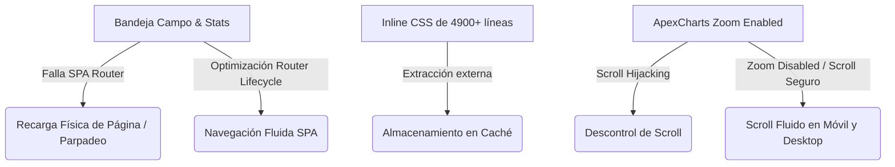

# UV Servicios - Centro de Optimizaciones y Mejoras del Sistema (Agosto 2026)

Este documento detalla las optimizaciones de arquitectura frontend, diseño responsivo, rendimiento y visualización de gráficos personalizados implementadas para resolver problemas de parpadeos, bloqueos de scroll y cuellos de botella de datos en la plataforma UV Servicios.

---

## 📋 Resumen de Mejoras Implementadas



---

## 🛠️ Detalle Técnico de los Cambios

### 1. Enrutamiento SPA Fluido y Ciclo de Vida del Router
* **Problema detectado:** Al navegar hacia el módulo administrativo de **Campo** o la **Gestión de Usuarios**, la SPA hacía una transición fallida porque sus scripts principales no estaban integrados con el ciclo de vida del router y cargaban el archivo JS de manera directa. Esto forzaba una recarga física (`window.location.reload`), provocando molestos flashes o parpadeos de pantalla.
* **Solución aplicada:**
  * Se configuraron [campo-admin.html](file:///c:/Users/johnl/OneDrive/Escritorio/uvservicios/campo-admin.html) y [gestion-usuarios.html](file:///c:/Users/johnl/OneDrive/Escritorio/uvservicios/gestion-usuarios.html) para vincular únicamente el script enrutador común [router.js](file:///c:/Users/johnl/OneDrive/Escritorio/uvservicios/js/services/router.js).
  * Se definieron y exportaron las funciones `initCampoAdmin` y `destroyCampoAdmin` en el controlador [campo-admin.js](file:///c:/Users/johnl/OneDrive/Escritorio/uvservicios/js/campo-admin.js) para inicializar y limpiar la bandeja dinámicamente.
* **Resultado:** Las transiciones de navegación entre páginas son instantáneas, fluidas y libres de cualquier parpadeo de pantalla.

### ⚡ Extracción de CSS Externo (Optimización de Carga y Caché)
* **Problema detectado:** `campo-admin.html` tenía un bloque inline `<style>` de aproximadamente **4000 líneas**, y `gestion-usuarios.html` tenía unas **950 líneas**. Esto inflaba el peso físico de los archivos HTML y evitaba que el navegador cacheara el diseño.
* **Solución aplicada:**
  * Se creó [campo-admin-page.css](file:///c:/Users/johnl/OneDrive/Escritorio/uvservicios/css/campo-admin-page.css) y [gestion-usuarios-page.css](file:///c:/Users/johnl/OneDrive/Escritorio/uvservicios/css/gestion-usuarios-page.css) respectivamente.
  * Se eliminaron los bloques inline de los HTMLs reemplazándolos con etiquetas `<link rel="stylesheet">` externas.
* **Resultado:** Reducción dramática del tamaño inicial del HTML (ej. `campo-admin.html` disminuyó de **151 KB a 33 KB**). Aceleración del tiempo de renderizado gracias al cacheado CSS nativo del navegador.

### 📱 Unificación del Breakpoint Móvil
* **Problema detectado:** Había una discrepancia entre el punto de quiebre CSS (`1180px`) y la detección JavaScript en `campo-admin.js` (`1024px`). En laptops pequeñas o tablets horizontales, JavaScript asumía un diseño desktop mientras que el CSS ya había convertido la bandeja en una sola columna, rompiendo la experiencia master-detail.
* **Solución aplicada:** Se cambió el breakpoint responsivo en [campo-admin.js](file:///c:/Users/johnl/OneDrive/Escritorio/uvservicios/js/campo-admin.js) a `1180` para coincidir perfectamente con la maquetación.
* **Resultado:** Layout master-detail uniforme y navegación táctil consistente en todos los dispositivos.

### ⏳ Integración del Cargador de Carga Premium
* **Problema detectado:** Al abrir Campo o Estadísticas, el DOM vacío se renderizaba instantáneamente antes de que las consultas de Supabase se resolvieran, lo que causaba saltos visuales bruscos (*Cumulative Layout Shift*).
* **Solución aplicada:** Se integró el markup `#premium-loader` en los HTML correspondientes y se configuraron las promesas en JS para agregar la clase `.hidden` al cargador premium una vez que todos los datos y gráficos están renderizados en pantalla.

### 📈 Motor de Gráficos Personalizados Inteligente
* **Puntos de Dispersión Automáticos:** Las variables pertenecientes a mediciones esporádicas de nivel/Echómetro (`nivel_dinamico`, `sumergencia`, `echometer_pip`) ahora se renderizan **automáticamente solo con puntos aislados** (ancho de línea `0` y tamaño de marcador `6`), previniendo que se tracen líneas artificiales que confundan a la ingeniería.
* **Líneas y Sombreados Automáticos:** Parámetros continuos de presión, eléctricos y VSD se grafican por defecto con líneas spline continuas y un degradado premium translúcido de fondo (`area` type).
* **Checkbox de Fondo:** Se agregó el control **"Sombreado de área"** en [stats.html](file:///c:/Users/johnl/OneDrive/Escritorio/uvservicios/stats.html) para permitir remover el degradado a gusto de la supervisión técnica.
* **Scroll Seguro sin Secuestros:** Se configuró `zoom: { enabled: false }` en ApexCharts para evitar que la gráfica intercepte el scroll vertical del mouse o el arrastre táctil del dedo. El usuario puede navegar verticalmente de forma 100% libre.

### 📸 Límite de Fotos de Soportes Incrementado (Operador Campo)
* **Problema detectado:** Los técnicos en campo necesitaban subir más respaldos visuales de un pozo, pero el sistema tenía un límite rígido de máximo 5 fotos por pozo por turno.
* **Solución aplicada:** Se aumentó el límite de carga de soportes de **5 a 20 imágenes** en los controladores [field-controller.js](file:///c:/Users/johnl/OneDrive/Escritorio/uvservicios/js/modules/field/field-controller.js) y [database-controller.js](file:///c:/Users/johnl/OneDrive/Escritorio/uvservicios/js/modules/database/database-controller.js).
* **Resultado:** Los técnicos ahora pueden adjuntar hasta 20 imágenes sin toparse con el límite restrictivo, facilitando el reporte de múltiples evidencias de ingeniería.

### 🔌 Nuevo Estatus: OFF / ATENCION AL CLIENTE
* **Problema detectado:** El equipo requería registrar pozos detenidos por atención/requerimiento del cliente y obligar al técnico a justificar dicha parada mediante el Diagnóstico y las Observaciones, omitiendo el ingreso de telemetría eléctrica (ya que el pozo está apagado).
* **Solución aplicada:**
  * Se agregó la opción `OFF / ATENCION AL CLIENTE` en [field.html](file:///c:/Users/johnl/OneDrive/Escritorio/uvservicios/field.html) y [dashboard-data.html](file:///c:/Users/johnl/OneDrive/Escritorio/uvservicios/dashboard-data.html).
  * Se actualizaron las validaciones en JS ([field-validation.js](file:///c:/Users/johnl/OneDrive/Escritorio/uvservicios/js/modules/field/field-validation.js), [field-controller.js](file:///c:/Users/johnl/OneDrive/Escritorio/uvservicios/js/modules/field/field-controller.js) y [field-formatters.js](file:///c:/Users/johnl/OneDrive/Escritorio/uvservicios/js/modules/field/field-formatters.js)) para clasificarlo como estado inactivo/OFF (saltando la verificación eléctrica pero forzando el llenado obligatorio de **Diagnóstico** y **Observaciones**).
  * Se integró en [estadisticas.js](file:///c:/Users/johnl/OneDrive/Escritorio/uvservicios/js/estadisticas.js) para clasificarlo correctamente como pozo "OFF" en las gráficas, sumarios y listados de incidencias.

---

## 🗄️ Parche de Base de Datos (Supabase)

Si persisten los errores HTTP 400 en la consola del navegador por campos omitidos al sincronizar tickets, ejecuta la siguiente sentencia en el **SQL Editor de Supabase**:

```sql
ALTER TABLE field_tickets ADD COLUMN IF NOT EXISTS submitted_at timestamptz NOT NULL DEFAULT now();
```
