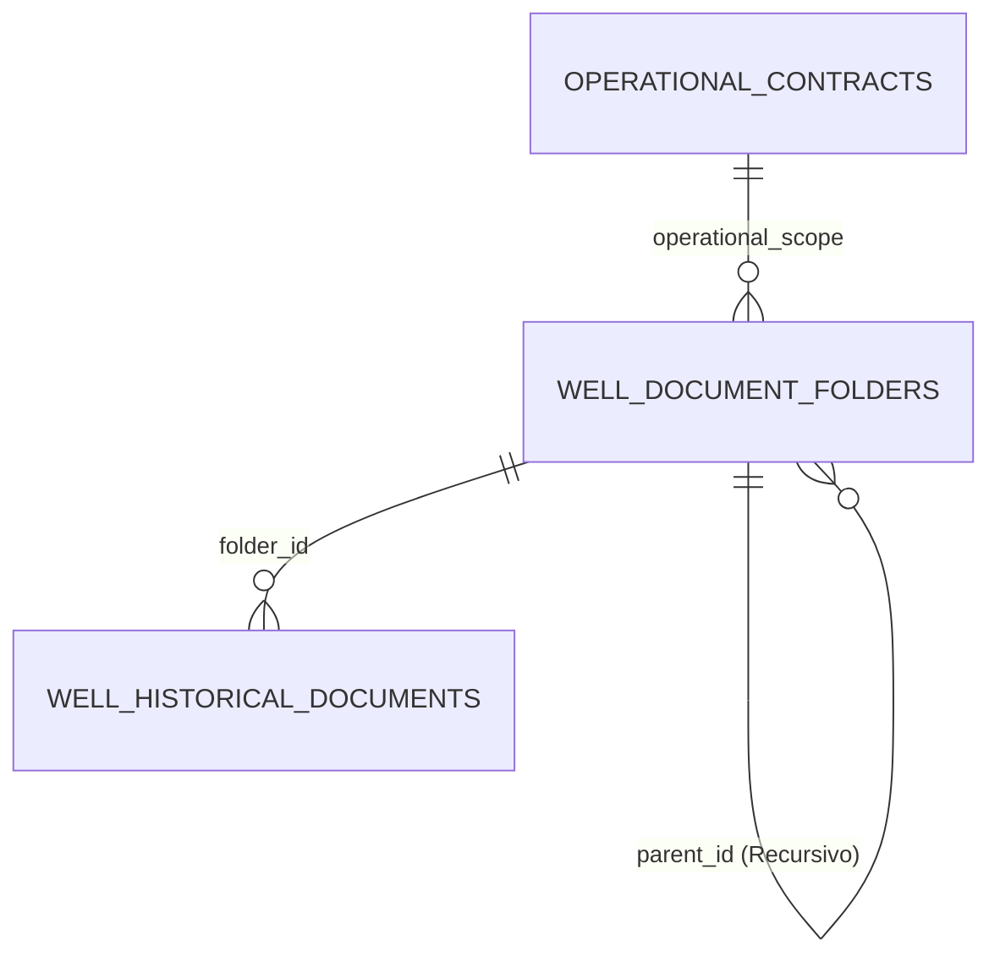

# Sistema de Expedientes Digitales por Pozo - UV Servicios

Este documento explica de forma detallada cómo se encuentra estructurada, vinculada y desarrollada la sección de **Base de Datos y Expedientes Digitales** en el ecosistema de UV Servicios.

---

## 1. Arquitectura de la Base de Datos (Supabase)

El sistema de expedientes digitales utiliza un modelo relacional dinámico sobre PostgreSQL en **Supabase** que asocia documentos históricos con una jerarquía de carpetas lógicas.

### Tablas Principales:
1. **`well_document_folders`** (Carpetas virtuales):
   - `id` (UUID, Primary Key): Identificador de la carpeta.
   - `operational_scope` (TEXT): Relacionado con el contrato operativo (`scope_key`).
   - `pozo_name` (TEXT): Pozo al cual pertenece la carpeta.
   - `parent_id` (UUID, Foreign Key recursiva): Permite tener niveles ilimitados de subcarpetas (`parent_id REFERENCES well_document_folders(id) ON DELETE CASCADE`).
   - `name` (TEXT): Nombre visible de la carpeta.
   - `description` (TEXT): Detalle o nota descriptiva de la carpeta.
   - `icon` (TEXT): Icono representativo (FontAwesome) renderizado dinámicamente.
2. **`well_historical_documents`** (Documentos físicos):
   - `folder_id` (UUID, Foreign Key): Vincula cada documento con su respectiva carpeta en `well_document_folders`. Si la carpeta es eliminada, todos los documentos vinculados se borran automáticamente en cascada (`ON DELETE CASCADE`).

---

## 2. Niveles de Navegación en el Frontend

La interfaz del usuario se divide en tres niveles organizativos fluidos y asíncronos:

* **Nivel 1: Grid de Pozos**: Muestra las tarjetas con todos los pozos asociados al contrato seleccionado y la cantidad total de documentos históricos cargados.
* **Nivel 2: Carpetas del Pozo**: Al dar clic en un pozo, se listan sus carpetas principales (tanto las predeterminadas como las personalizadas creadas por el usuario) con sus respectivos contadores de archivos activos.
* **Nivel 3: Vista de Archivos y Subcarpetas**: Al ingresar a una carpeta, se muestran sus subcarpetas del nivel actual y una tabla interactiva con detalles de cada archivo (nombre, descripción, peso, autor, fecha, botones para ver previsualización, descargar, editar metadatos o eliminar).

---

## 3. Características Clave Desarrolladas

### 🧙‍♂️ Wizard de Creación de Carpetas en un Solo Modal
Se diseñó un asistente contextual con **SweetAlert2** integrado que elimina pasos innecesarios. En un solo modal, el usuario puede:
- Definir nombre y descripción.
- Seleccionar un icono representativo de forma visual.
- Elegir pozos de destino mediante un checklist interactivo de dos columnas (con la opción de seleccionar/deseleccionar todos y con el pozo actual siempre pre-marcado).

### 🔍 Buscador Global Inteligente (Brutal Search Engine)
El buscador general (`#db-search-input`) se convirtió en un motor de búsqueda global inteligente:
- **Detección Automática de Pozos**: El buscador analiza el texto ingresado. Si detecta que alguna de las palabras coincide con el nombre de un pozo (ej: "CEI0003" o "TOM0010"), automáticamente aísla esa palabra, define ese pozo como destino de la búsqueda y busca el resto del texto dentro de ese pozo específico.
- **Búsqueda Cruzada en Todos los Pozos**: Si no se detecta ningún pozo específico y estás en la vista general (Nivel 1), busca en tiempo real en todos los pozos y carpetas simultáneamente.
- **Vista Unificada de Resultados**: Muestra una tabla completa con los resultados detallando:
  * El pozo donde se encuentra.
  * La carpeta donde está alojado.
  * El nombre del archivo y descripción.
  * Tamaño y fecha.
  * Acciones interactivas directas: **Ver**, **Descargar** e **"IR A CARPETA"** (esta última te redirige y navega automáticamente al pozo y carpeta exacta de origen de ese archivo con un solo clic).
- **Búsqueda contextualizada (Nivel 3)**: Si ya has ingresado dentro de una carpeta o subcarpeta, el buscador se enfoca únicamente en los archivos y subcarpetas de ese nivel para búsquedas locales rápidas.

### 🚀 Optimización UX: Cero Parpadeos (Anti-Flicker)
Para garantizar una experiencia fluida y premium al navegar entre secciones:
1. **Limpieza Inmediata**: Al cambiar de carpeta o vista, se vacía el contenedor del DOM (`container.innerHTML = ''`) previniendo que se rendericen temporalmente archivos antiguos mientras la nueva consulta está en camino.
2. **Debounce en Loaders**: El spinner de carga tiene una tolerancia de `220ms` de retraso. Si la consulta de base de datos se resuelve más rápido que ese umbral, el loader nunca se muestra, logrando transiciones instantáneas y sin saltos visuales.

---

## 4. Flujo de Vinculación de Archivos

Cuando se sube un nuevo archivo al sistema:
1. Se asocia al pozo seleccionado (`pozo_name`) y al contrato activo (`operational_scope`).
2. Se le asigna el `folder_id` correspondiente a la vista abierta en el nivel 3.
3. El archivo físico se almacena en el bucket de Supabase Storage.
4. Al listar los archivos, se generan **URLs firmadas temporales** de forma asíncrona para permitir la previsualización directa y la descarga segura desde el cliente sin comprometer la seguridad de los buckets.
